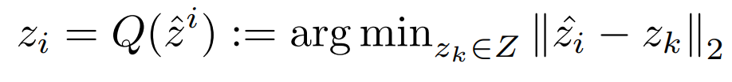

# MotionGPT: Human Motion as a Foreign Language

>Human motion 은 사실 어떠한 의미를 지니고 있는 모션들의 연속이다. motion이 곧 바디랭귀지를 의미하는 점을 아이디어로 삼았다.  따라서 이 모델에서는 휴먼 모션과 언어를 fusing(융합/결합) 하려 했다. 
>특히 discrete 한 vector quantization 을 사용해 3D motion 을 motion token 으로 전환했다. 
>저자들은 motion-language data를 사용해 motionGPT 를 학습시킨 후, prompt-question task 에 fine-tuning 했다. 
>저자들은 확장된 실험을 통해 여러가지 multiple task 에서 motionGPT가 SOTA performance 를 달성함을 보여주었다. 

최근 GPT, BERT, T5, 등의 다양한 LLM 들이 downstream task 에 대한 다양한 적용들이 가능함을 증명해왔다. 하지만, human motion 과 language 에 대한 general pre-trained model 은 제안된 적이 아직 없었다. 

또한, motion task 는 다양한 task 들이 존재하지만 이들 모두를 포괄적으로 아우르는 모델은 존재하지 않음 

각 task 의 논문들. 필요하면 읽어보자!

    motion generation : 31, 11, 48, 54, 59
    motion captioning : 9, 12 
    motion prediction : 58, 63, 25

- **text-to-motion w/ Diffusion approach :** 

    1. MDM ⇒ motion diffusion model with conditional text tokens from CLIP
        
        모션 디퓨전 모델인데, CLIP model 로 condition 을 줘서 diffusion 을 수행함 
        
    2. MLD ⇒ motion latent space 를 통합해 diffusion process 가 더 잘 진행되도록 했다. 

- **text-motion paired data approach:**

    1. Motion CLIP ⇒ 
    2. TM2T

    → 문제점 : language 와 motion 을 분리된 modality 로 취급했다

    → supervision 이 task specific 하기 때문에 처음 보는 data를 처리하기 어려워했다. 

    → comprehensive understanding 이 부족했다. 

 

저자들은 다음과 같은 두가지 문제를 main problem 이라고 생각하고, 해결하고자 했다. 

1. language 와 motion 사이의 modeling 기법 
    - BEiT-3 : 모션을 특정 외국어라고 생각해 모션과 언어를 결합해 하나의 인코딩으로 만들었다. 
    언어와 모션간의 관계성을 두드러지게 만들었던 경우이다. 
    - 한편 이렇게 학습시킨 모델은 마치 **instructGPT**처럼 textual instruction 의 형태를 띄고 있는 prompt 를 가능하게 하였다. 
        
2. 다른 task 에 사용할 수 있는 단일 multi-task frame work 구성 

 

해당 논문에서는 단일화된 모션-언어 프레임워크인 MotionGPT 를 제안하고 있다. 

- VQ-VAE를 사용하여 motion vocabulary를 생성함

    - 영어 vocabulary 와 유사하게 만들기 위해서, 모션 데이터를 모션 토큰 시퀀스로 전환
    - 모션 토큰들은 pretrianed 언어 모델을 [38, 5] 사용해, 내재되어있는 문법과 motion 언어를 학습하게 하였다. 
    - two-stage 구조 사용 
        1) language model을 raw motion 데이터로만 학습시킴 
        2) prompt tuning 을 위해 language model 을 instruction dataset 에 finetuning 

### Contribution

1. motion-language pre-trained model 
    motion 을 foreign language 처럼 학습함
2. motion-language training scheme 을 사용한 instruction tuning 
3. general motion benchmark for multi-task evaluation 

### Method

#### 1. motion tokenizer 

raw motion data → discrete motion tokens 를 위해 

- 3D human motion tokenizer ν 를 훈련
    - VQ-VAE 구조 로 이루어졌음
    - encoder 
        : discrete 한 motion token 생성 (high informative density를 가짐)
        1.  1D convolution 사용해 latent vector 추출 
        2. z~ 를 codebook 을 통과시켜 discrete quantization 수행 
        3. codebook 은 K 개의 latent embedding vector 를 포함하고 있으며, d 차원으로 이루어져 있음 
        4. quantization process Q() 는 각 row vector b 를 가장 가까운 codebook entry 로 전환시킨다. 

            

            
            

    - decoder 
        : motion token 을 motion sequence 로 reconstruct 
            - 양자화를 거친 후, 다시 motion space 로의 reprojection 을 수행한다. 

    - loss :

        1. reconstruction loss : 
        2. embedding loss : 
        3. commitment loss : 
        4. L1 smooth loss 
        5. velocity regularization

